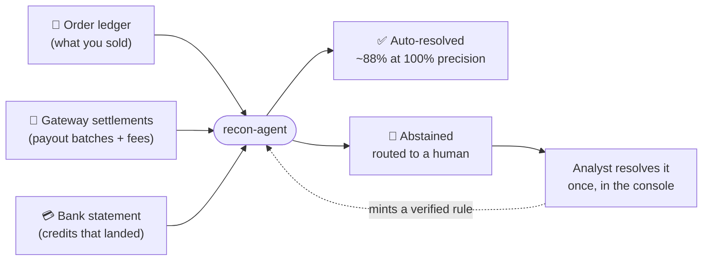
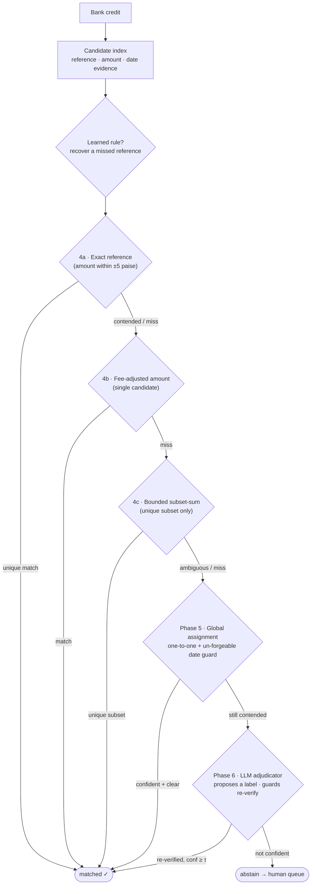

# recon-agent

Three-way settlement reconciliation for Indian payment flows. It ingests an **order
ledger**, a **payment-gateway settlement file**, and a **bank statement**, and works
out which settlement batches correspond to which bank credits — **while being willing
to say "I don't know."**

> **Deterministic first, model last.** ~88% of records resolve with zero LLM calls;
> the model is invoked at exactly one decision point, on the ambiguous remainder.
> The headline metric is **auto-resolve rate at 100% precision**, not match rate.

Built for the Razorpay AI Buildathon (Track 4).

---

## The problem, in plain terms

When a business takes online payments, three different systems record the *same money*
in three incompatible ways:

- **Your order ledger** — "customer paid ₹500 for order #123 on Monday."
- **The payment gateway** (Razorpay) — bundles many payments, deducts its fee, and pays
  you **one lump** on a settlement schedule: "here's ₹48,700 on Wednesday."
- **Your bank statement** — "₹48,700 arrived Wednesday. Note: `SETTLEMENT PYT-7261-6751 CR`."

The daily question every finance team must answer is: **which orders are inside that
bank deposit?** It's hard because fees and taxes make the amounts not line up, one
deposit bundles dozens of orders, the reference codes in bank narrations are mangled or
missing, and the data contains genuine look-alikes (two deposits for the same amount on
the same day; a fraudulent-looking entry that copied a real reference). Today this is
mostly done **by hand in Excel** — slow, and one wrong match is misattributed money.

**recon-agent automates the matching — and, crucially, refuses to guess when it isn't
sure.** It auto-resolves what it can prove, and hands the genuinely ambiguous rest to a
human with all the evidence laid out.



---

## The thesis: precision over coverage

A reconciliation tool that is 98% accurate is not 98% useful — it is a tool an analyst
can never trust, because they still have to re-check every line to find the 2% it got
wrong. The only number that lets a human stop checking is **precision = 100%**. So this
system optimises for auto-resolve rate *subject to* never being wrong, and it earns that
by **abstaining** whenever the evidence is ambiguous. An abstention is not a failure — it
is a correct, honest "route this to a human." A wrong auto-match is the only real
failure, and the design spends everything to drive it to zero.

Concretely that means:

- **Deterministic layers do the bulk of the work** (exact-reference, fee-adjusted
  amount, bounded subset-sum) with no model and no cost.
- **A global assignment step** resolves contention (several credits eyeing one batch)
  with a one-to-one optimum — and refuses to be fooled by a forged reference.
- **The LLM is the last touchpoint, not the first.** It only ever sees the contended
  remainder, it proposes a *label* from pre-enumerated options, and **every proposal is
  re-verified by the same deterministic guards** before it counts. The model can
  propose; only arithmetic disposes.
- **A learning loop** turns each analyst resolution into a reusable, *verified* rule —
  the system gets better as it is used, without ever letting "learned" mean "trusted."

---

## How it works — the decision cascade

Each bank credit runs through an ordered cascade. **The first layer confident enough to
be safe wins**; anything ambiguous falls through to the next layer; whatever survives the
whole cascade is abstained (routed to the human queue). Every layer shares one global
*consumed-line / consumed-batch* ledger, so a settlement line can be spent **at most
once** — the single invariant that makes the traps fail safely.



> A confident **`no_match`** (e.g. a trap that matches nothing real) is also a *decision*
> — it counts toward coverage alongside `matched`. Only `abstain` goes to the human.

| layer | what it does | why it's safe |
| ----- | ------------ | ------------- |
| **4a Exact reference** | narration reference == batch reference, amount within ±5 paise | if *two* credits claim one batch, neither auto-resolves — deferred to assignment |
| **4b Fee-adjusted amount** | single candidate whose recomputed net (gross − fees/tax) matches | only fires when exactly one batch is viable |
| **4c Bounded subset-sum** | finds the subset of free lines summing to the credit | matches only on a **unique** subset; ambiguous or oversized → abstain |
| **Phase 5 Assignment** | max-weight one-to-one over contended credits × batches | winner must be the **best-dated** claimant — a forged reference can't win |
| **Phase 6 Adjudicator** | LLM picks a label from pre-enumerated options | every proposal re-summed & guarded; an adversarial model still can't break precision |

Full walkthrough, the trap taxonomy, and the guards: **[ARCHITECTURE.md](ARCHITECTURE.md)**.

---

## Results

Two 800-record datasets: **train** (seed 42, the set thresholds were tuned on) and
**holdout** (seed 7, never tuned on). Both run with the LLM **off** — these are the
zero-cost, zero-LLM baseline numbers.

| Metric                              |     Train |   Holdout |
| ----------------------------------- | --------: | --------: |
| Records                             |       800 |       800 |
| **Auto-resolve rate (coverage)**    | **87.6%** | **87.9%** |
| **Precision on decided records**    |  **100%** |  **100%** |
| **Hallucinated trap matches**       |  **0/40** |  **0/40** |
| Resolved with zero LLM calls        |      100% |      100% |
| Cost per record                     |     $0.00 |     $0.00 |
| Latency per record (p50 / p99)      | 0.74 / 0.85 ms | 0.75 / 0.85 ms |

**Coverage holds 100% precision across the entire confidence sweep** (τ = 0.00 → 0.90),
because the deterministic layers only ever emit high-confidence matches. The
highest-coverage threshold that still holds 100% precision is τ = 0.00.

Per-difficulty (holdout): `easy` 360/360, `medium` 240/240 — both 100% coverage;
`hard` 66/160 (41.2%) — the deliberately-ambiguous splits and near-duplicates the
system *correctly* declines to guess; `trap` 37/40 decided, **all correct** (the traps
are finalised as confident `no_match`, not mis-matched).

Where the resolutions come from (holdout): exact reference 71.6%, fee-adjusted amount
10.6%, global assignment 1.0%, abstained 16.8%.

Captured reports live in [`reports/`](reports/) (`holdout_report.txt`,
`holdout_metrics.json`, `train_metrics.json`). Regenerate any time — the pipeline is
deterministic across hash seeds, so the numbers reproduce byte-for-byte.

---

## The learning loop (the part that compounds)

When an analyst resolves a parked exception in the console, if the batch's reference was
*present but unparsed* in the narration (a novel grouping like `PYT-7261-6751-3613` vs
`PYT726167513613`), the system induces a reusable, scoped rule — and a re-run applies it
across the whole file. In the demo dataset, **one** human resolution recovers **16/16**
similar credits, lifting auto-resolve from **27.3% → 100%** at **100% precision, 0
hallucinations**. The safety guarantee: a learned rule only *points* at a candidate; the
same amount guard the rest of the pipeline uses still decides whether the pointer is
right, so a bad rule can never manufacture a wrong match.

---

## Quick start

```bash
# 1. environment (Python 3.11, uv)
uv venv && uv pip install -e ".[dev]"

# 2. generate the datasets (deterministic; seeds are the dataset identity)
python -m src.generator.generate --records 800 --seed 42 --out data/generated/train/
python -m src.generator.generate --records 800 --seed 7  --out data/generated/holdout/

# 3. score the pipeline against ground truth
python -m src.eval.report --data data/generated/holdout/ --matcher pipeline

# 4. run the tests
python -m pytest tests/ -q
```

The whole pipeline runs **without an API key** — schema mapping falls back to an alias
table and the adjudicator simply abstains, so you get the full zero-LLM baseline above.
To enable the LLM adjudicator, put a key in `.env` (see `.env.example`) and add
`--adjudicate`. Model: `claude-sonnet-4-6`. Force the zero-LLM path explicitly with
`RECON_DISABLE_LLM=1`.

### The console

A FastAPI backend serves a React/Vite/Tailwind exception-queue console. The product is
the drill-down: an analyst inspects a parked credit (narration, extracted references,
every candidate batch with its amount/date deltas), resolves it in two clicks, and the
resolution mints a learned rule that a re-run applies across the whole batch — the
coverage lift is shown live.

```bash
# build the frontend once, then serve everything (SPA + /api) from one origin
cd frontend && npm install && npm run build && cd ..
python -m uvicorn src.api.main:app --port 8000
# open http://localhost:8000  → try the "Learning-loop demo" dataset
```

For live frontend development, run `npm run dev` (Vite on :5173, proxying `/api` to the
backend on :8000) alongside the uvicorn command above.

### Live Razorpay data (Settlement Recon API)

The engine reconciles **real Razorpay data**, not just synthetic fixtures. Razorpay's
**Settlement Recon Report API** (`GET /v1/settlements/recon/combined`, via the official
`razorpay` Python SDK) returns every settled transaction with its `settlement_id`,
`settlement_utr`, fees/tax, and linked `order_id` — two of our three inputs, straight
from the source. `src/ingest/razorpay_source.py` maps those items into the canonical
models, so live data flows through the identical pipeline.

```bash
# live: put rzp_test_* keys in .env, then pull a month of settlements into a dataset
python -m src.ingest.razorpay_pull --year 2026 --month 8 --out data/razorpay/

# offline (no key): the repo ships a real-shaped recon payload for the demo
python -m src.ingest.razorpay_pull --from-json data/razorpay_recon_sample.json --out data/razorpay/
python -m src.eval.report --data data/razorpay/ --matcher pipeline
```

In the console, the **"Razorpay API data"** button loads this dataset directly. Only the
network fetch touches Razorpay; the mapping is pure and unit-tested, so the whole path
runs offline against the bundled payload.

---

## Why it matters for Razorpay

Razorpay *is* the gateway in the diagram above — the middleman settling money to millions
of Indian merchants. Reconciliation is those merchants' daily pain, at a scale no team
can do by hand, where a single wrong match is misattributed funds and a compliance risk.
This design fits that exactly: **trustworthy** (100% precision or an honest abstention),
**high-scale and near-free** (88% solved by plain arithmetic, the model used only on the
hard remainder), and **self-improving** (every analyst correction becomes an automatic
rule). And it plugs straight into the platform: it pulls settlements and orders from
Razorpay's **Settlement Recon Report API** and reconciles them end-to-end. It turns
reconciliation from a manual chore into a product surface.

---

## Project layout

```
src/
  generator/      synthetic data + ground truth (orders, settlements, bank, traps)
  ingest/         schema mapping (alias table, LLM fallback) + dataset loader
                  razorpay_source.py / razorpay_pull.py — pull the live Settlement Recon API
  fees.py         the settlement fee model (gross → net)
  models.py       pydantic types: Order, SettlementLine, BankCredit, MatchResult, …
  match/
    candidates.py    per-credit candidate index (UTR/amount/date evidence)
    deterministic.py Phase 4 — exact-ref, fee-adjusted, bounded subset-sum
    assignment.py    Phase 5 — global max-weight one-to-one assignment
    adjudicator.py   Phase 6 — LLM adjudicator (propose-a-label, guards dispose)
  rules/
    learned.py       Phase 7 — induce & apply verified narration rules
    experiment.py    the learning-loop lift experiment
  pipeline.py     orchestration: reconcile() / reconcile_dataset()
  eval/           report.py (scoring + tradeoff curve) + harness.py (threshold sweep)
  llm.py          thin Anthropic client wrapper (off by default)
  api/main.py     FastAPI backend for the console
frontend/         React + Vite + Tailwind exception-queue console
tests/            73 tests; the whole suite needs no API key
```

---

## Engineering log

Every non-trivial bug and design finding is written up in
**[ENGINEERING_LOG.md](ENGINEERING_LOG.md)** — including the two precision bugs found en
route (a hallucinated duplicate-UTR match, and a forged-reference assignment), the
finding that the LLM's real job is the *opposite* of what we first assumed, the design
of the learning loop's safety guard, and the client/server contract bug the end-to-end
UI check turned up. It is the honest account of what broke and why the fixes hold.
